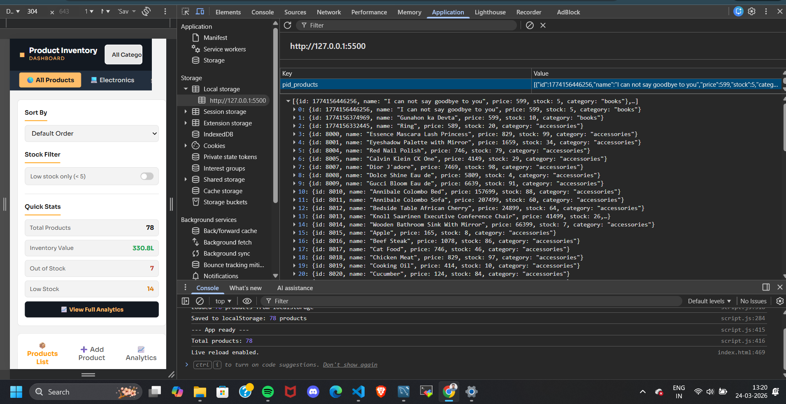
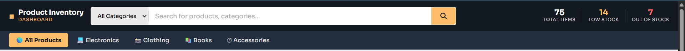
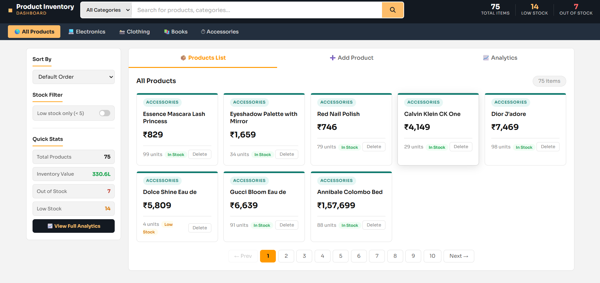
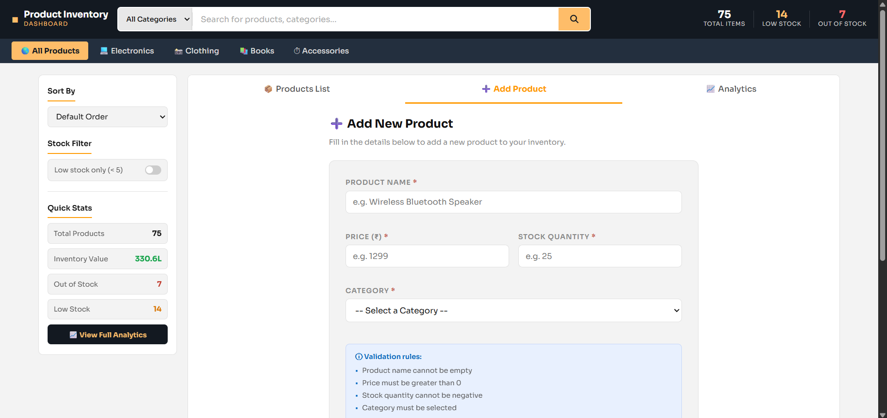
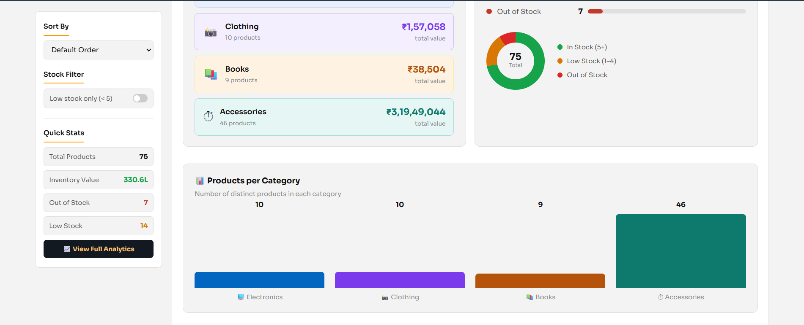
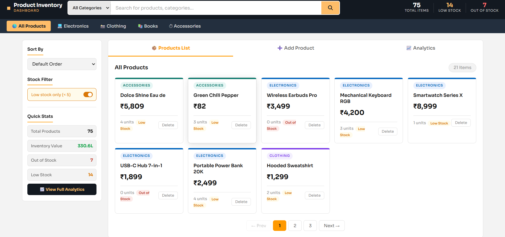
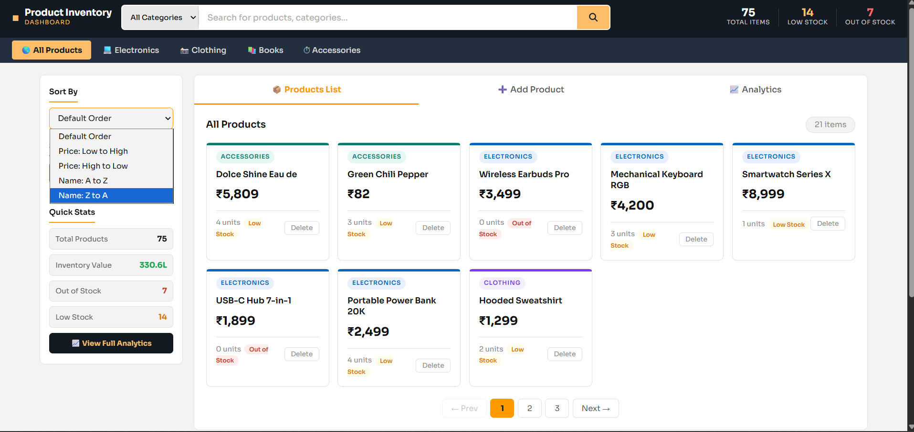
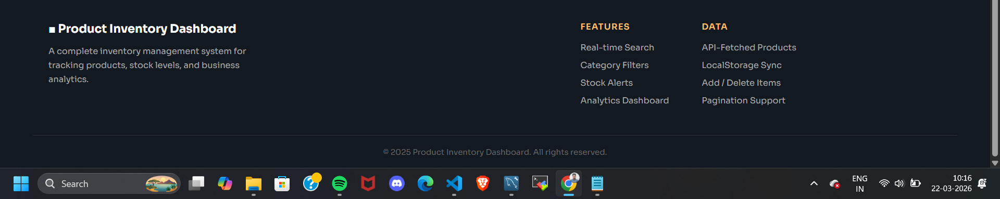

#  Product Inventory Dashboard
 
A complete inventory management web app built using only HTML, CSS, and JavaScript.
No React. No Bootstrap. No libraries. Everything is written from scratch.

# At the very first lets talk about How data is being stored and Did we fetch Api ? 

So , Answer is yes .. I am doing both save the data in local storage as well as fetching some data from api and combine them and showing on dashboard.

### This API Used
 
URL: `https://dummyjson.com/products?limit=100`
 
This is a free public API that returns fake product data for practice and testing. We fetch 40 products from it on the first visit and combine them with our own 38 default products. Prices are converted from USD to Indian Rupees by multiplying by 94. Category names like "smartphones" are converted to "electronics" so they fit our 4 categories.

###  Where is Data Stored?
 
All product data is saved in your browser's **localStorage** under the key `pid_products`.
 
To see it yourself:

1. Click the **Application** tab.
2. Click **Local Storage** on the left.
3. You will see the key `pid_products` with all product data stored as JSON text.

 

##  Screenshots — What Each Screen Does

### Screenshot 1 — The Top Navigation Bar

It is the very top of the website you can see :

On the left side : The logo says "Product Inventory" with "DASHBOARD" written below it in orange. The small orange square before it is the logo icon.

On the middle Side : A big search bar. It has a dropdown on the left that says "All Categories" — you can change this to Electronics, Clothing, Books, or Accessories before searching. The orange button on the right is the search button.

On the right side : There are there Live numbers that updates automatically:
- 78 — Total Items in the inventory right now
- 14 — Products that have very low stock (less than 5 units left)
- 7 — Products that are completely out of stock (0 units)

These three numbers change whenever you add or delete a product. You don't have to refresh the page.

On the down side : The categories are listing according Products.

### Screenshot 2 — The Left Sidebar

This is the panel on the left side of the page. It has four sections:

Sort By — A dropdown with 5 options to change the order of the product cards. Default, Price Low to High, Price High to Low, Name A to Z, Name Z to A.

Stock Filter — A toggle switch. Right now it is OFF (grey). When you turn it ON it turns orange and shows only the products that have less than 5 units in stock. It is useful when you want to quickly see which products need to be restocked.

Quick Stats — Four rows showing live numbers from the inventory:
- Total Products: 78
- Inventory Value: 330.6L (this means ₹3,30,60,000 — calculated by multiplying each product's price × stock quantity and adding them all up)
- Out of Stock: 7 (shown in red)
- Low Stock: 14 (shown in orange)

View Full Analytics button — A dark button at the bottom. Clicking it takes you directly to the Analytics tab where you can see charts and detailed breakdowns.

### Screenshot 3 — Products List (Tab 1 — Main View)

This is the main view of the dashboard. All products are shown as cards in a grid.

You can see three tabs at the top — Products List (currently active, shown with an orange underline), Add Product, and Analytics.

Each product card shows:
- A coloured stripe at the very top of the card (teal for Accessories, blue for Electronics, purple for Clothing, orange for Books)
- The category name as a small badge (like "ACCESSORIES" or "ELECTRONICS")
- The product name in bold
- The price in Indian Rupees (₹)
- How many units are left in stock
- A coloured status badge — green "In Stock", orange "Low Stock", or red "Out of Stock"
- A Delete button — clicking it removes that product immediately from the product page.
 
At the bottom you can see "pagination" — the grid shows 8 products at a time. There are 10 pages total because there are 78 products. The page 1 button is highlighted in orange.

### Screenshot 4 — Add Product Tab (Tab 2)

This is the second tab. When you click "Add Product" at the top, this form appears.

The form has 4 fields:
- Product Name — a text box where you type the name of the product
- Price (₹) — where you type the price in Indian Rupees
- Stock Quantity — how many units you have
- Category — a dropdown to select Electronics, Clothing, Books, or Accessories
 
Below the fields there is a blue info box that lists the **validation rules**:
- Product name cannot be empty
- Price must be greater than 0
- Stock quantity cannot be negative
- Category must be selected
 
If you try to submit the form without filling in a field correctly, a red error message appears below that specific field. The form will not submit until all 4 fields are valid.
 
When the form is submitted successfully, a green success message appears and the product immediately shows up at the top of the Products List.

### Screenshot 5 — Analytics Tab (Top Section — KPI Cards)

This is the third tab — the Analytics page. It shows a complete overview of the entire inventory.

At the top it says "Inventory Analytics" and shows the last updated time — 10:06:22 am. This time updates every time you open this tab.

There are 6 large cards arranged in 2 rows of 3:

Row 1:
- 75 — Total Products — how many products are in the inventory right now.
- 3.3 Cr — Inventory Value — the total money value of all stock combined (price × quantity for every product, all added together). It shows Cr because the number is in crores.
- ₹9,166 — Avg. Product Price — the average price of all 75 products.
 
Row 2:
- 4 — Active Categories — Electronics, Clothing, Books, Accessories
- 7 — Out of Stock — products with 0 units
- 14 — Low Stock Alert — products with 1 to 4 units remaining
 
Below the cards you can see the start of the Category Breakdown section — Electronics shows ₹9,15,995 total value with 10 products, and Clothing shows ₹1,57,058 with 10 products.
 
On the right you can see the start of the Stock Health section with green, orange, and red progress bars.

### Screenshot 5(b) — Analytics Tab (Bottom Section — Charts)

This is the lower part of the Analytics tab after scrolling down.
 
Left side — Category Breakdown cards (continued):
- Clothing — ₹1,57,058 — 10 products
- Books — ₹47,489 — 9 products
- Accessories — ₹3,19,60,824 — 46 products (this is highest because API fetched many accessories)
 
Right side — Stock Health donut chart:
The circular chart is made using pure CSS (no chart library). It is divided into three coloured sections:
- Green = In Stock (54 products with 5+ units)
- Orange = Low Stock (14 products with 1-4 units)
- Red = Out of Stock (7 products with 0 units)
The number 75 in the center is the total.
 
**Bottom — Products per Category bar chart:**
Four bars showing how many products are in each category. The bar heights are proportional — Accessories has 46 products so its bar is the tallest. Electronics and Clothing both have 10 so their bars are equal. Books has 9 so its bar is slightly shorter. The bars are color-coded to match their category colors throughout the whole app.

### Screenshot 6 — Low Stock Filter Turned ON

This screenshot shows what happens when you turn the Low Stock toggle ON in the sidebar.
 
You can see:
- The toggle switch in the sidebar is now orange and switched ON (it was grey before)
- The sidebar border has changed to orange to show it is active
- The product grid now shows only 21 items instead of 75 — these are the products that have less than 5 units in stock
- Pagination now shows only 3 pages instead of 10

### Screenshot 7 — Sort Dropdown Open

This screenshot shows the Sort By dropdown in the sidebar while it is open. You can see all 5 options:
- Default Order
- Price: Low to High
- Price: High to Low
- Name: A to Z
- Name: Z to A (currently highlighted in blue — the user is about to select this)

### Screenshot 8 — Footer

This screenshot shows thw footer of thw website Although I has two sections:

On the left side : 
- There is name of website which is Product Inventory dashboard and with a bit description.

On the right side :
- This section shows what we have made one of them shows features of this website .
- second shows API fetched Products , local storage , add and delete products and pagination support.